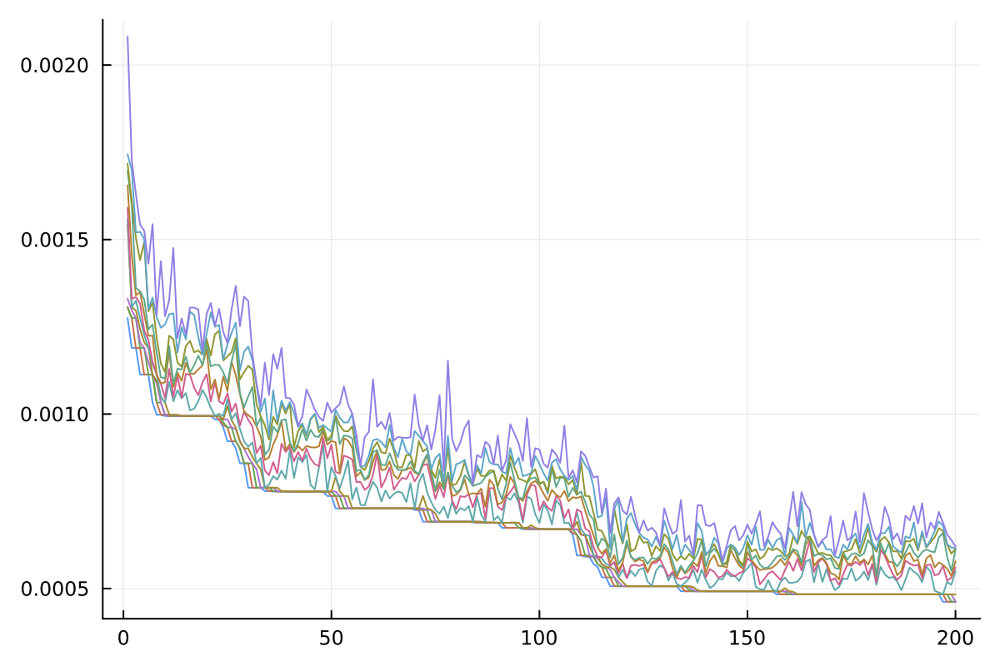
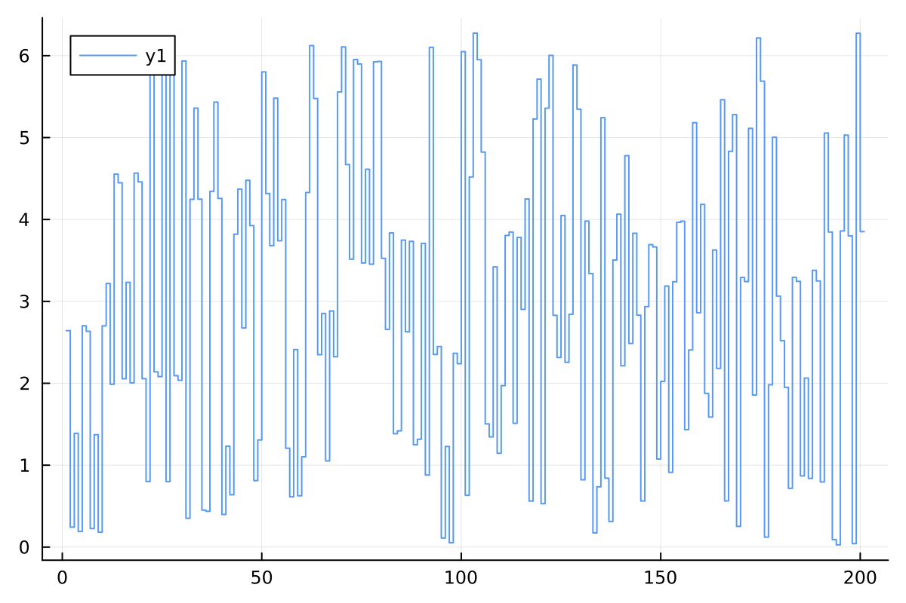
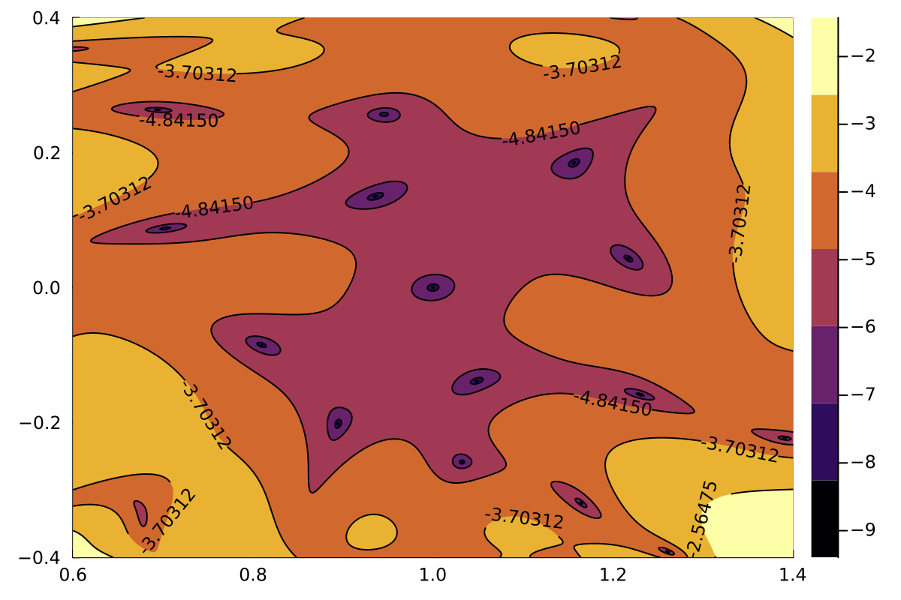
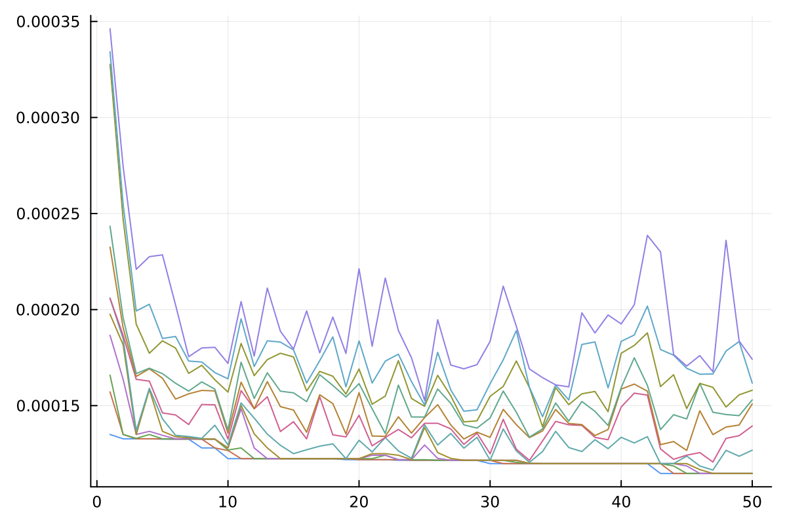
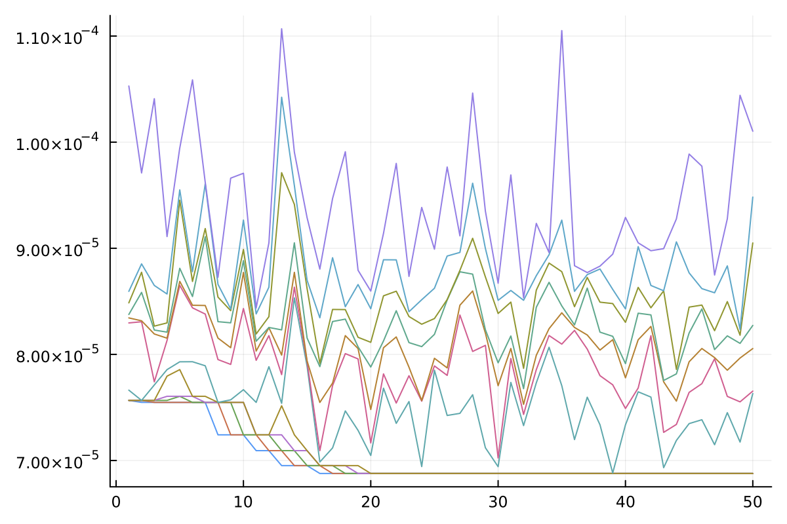
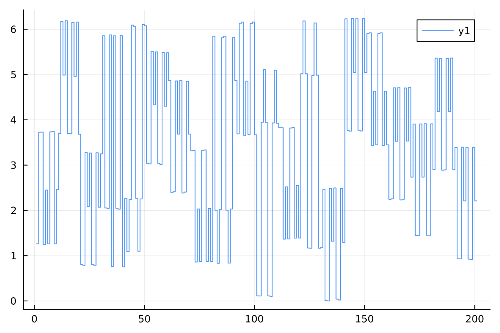
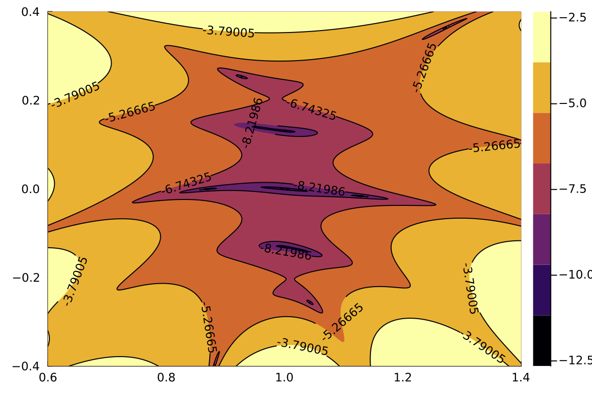

# User Manual

This page contains everything most users will need to know. 

## Basic Use


### Optimization Parameters

All parameters defining an optimization are stored in an `OptimizationParameters` object with reasonable default values.
See [Background Details](@ref) below for further explanations of these parameters.

```@docs
OptimizationParameters
```

### Performing Optimizations

Once the parameters have been defined, the optimization can be run using `new_optimization`.
Interrupted optimizations can be restarted using `continue_optimization`.

```@docs; canonical=false
new_optimization
continue_optimization
```

### Optimization Output

While the optimization prints some progress information to standard output, all important output is stored in the given folder.

More information on how to read and write this data, see [Persistence Functions](@ref).  
    

#### Parameters

The parameters are stored as a JSON file in `parameters.json`. Don`t change the file after its creation.

#### Final and Intermediate Pulses

The pulses of each generation are stored in a CSV file, where each column represents one pulse consisting of a sequence of phases, and the pulses are ordered by their objective function value (the first pulse is the best one).
The pulses of the cycle based optimization are stored in `pulses/optimization-cycle/generations/gen-x.csv`, where `x` stands for the generation.
For the full optimization the files are `pulses/optimization-full/generations/gen-x.csv`.

The best pulse of the last generation is stored in a Matlab file `pulses/final/optimal-pulse.mat` and a CSV file `pulses/final/optimal-pulse.csv`.

Moreover, the optimal pulse is plotted in full `plots/final/full-pulse.pdf`, and each cycle individually `plots/final/pulse-cycles/cycle-x.pdf`.

The cost profile of the final pulse is plotted in `plots/final/cost-profile.pdf`.


#### Optimization Traces

The traces of the GRAPE optimizations are stored in `plots/optimization-cycle/generations/gen-x.pdf` and
`plots/optimization-full/generations/gen-x.pdf`.

The traces of the genetic algorithm are stored in `plots/optimization-cycle/evolution.pdf` and
`plots/optimization-full/evolution.pdf`.


## Background Details

The controlled Hamiltonian of the single qubit system is 

``H = \Omega\big( (1+\Delta\Omega)( \cos(\phi(t))\frac{\sigma_x}{2} + \sin(\phi(t))\frac{\sigma_y}{2} ) +  \delta\frac{\sigma_z}{2} \big) ``

where ``\sigma_x,\sigma_y,\sigma_z`` denote the Pauli operators. ``\Omega`` denotes the Rabi frequency in rad/s (parameter `Rabi`), ``\Delta\Omega`` denotes the maximum amplitude deviation relative to the Rabi frequency (parameter `RabiFDev`), and ``\delta`` denotes the maximum detuning relative to the Rabi frequency (parameter `Detuning`).

We assume that the pulse phase ``\phi(t)`` is piecewise constant on time intervals of length given in parameter `Δt`. The total time duration of the pulse is `Δt*NSteps*Ncycles`.

The cost functional is the infidelity of the final propagator with the identity matrix (up to global phase) averaged over the range of amplitude deviations and detunings, and tracked over the ``N`` cycles (parameter `Ncycles`) of the pulse:

``C[\phi] = \tfrac1N \sum_{n=1}^N \sum_{m=1,k=1}^{M,K}w_{m,k} \big(1-\tfrac14|\operatorname{tr}(U_{\delta_k,\Delta\Omega_m}(n\cdot s\Delta t))|^2\big)``

A pulse with a low cost function value will refocus the state after every ``s`` (parameter `NSteps`) time steps. The number of amplitude deviations and detunings (``M,K``) is set in parameters `NRab` and `NDet`, and the weights follow a Gaussian distribution with standard deviation `sigRab` and `sigDet` respectively.

The full pulse optimization uses the GRAPE algorithm to efficiently compute the gradient of the cost function with respect to the pulse phases, and then updates the pulse using standard optimization algorithms (typically BFGS and LBFGS). The optimization can be controlled using parameters `gradTol` and `maxIter`.

Since this is a local optimization algorithm for a highly non-convex cost function, the result strongly depends on the initial state.
To turn this into a global optimization algorithm, we optimize a population of pulses (parameter `NPulses`) over several generations (parameter `NGens`) using a genetic algorithm.
As shown below, starting from random initial pulses, the optimized pulses have the structure similar to UR pulses, but more general. We call such pulses "XUR pulses", and use these pulses as initial sequences to accelerate the optimization. 
Moreover we can restrict the optimization to the subset of XUR pulses by applying GRAPE only to the overall phase of each pulse cycle. The number of such generations is given in the parameter `NGensXUR`.

## Example Optimizations

Here we provide two example optimizations, and at the same time illustrate the efficiency of the approach.

### Full Pulse Optimization

First we want to optimize a pulse of 20 cycles with 10 ``\pi``-pulses each. 
We will only use full pulse optimization (`NGensXUR=0`).
For the genetic algorithm we use a population size of 12 pulses evolved over 200 generations.
We use the function `new_optimization_no_xur` to start from random pulses without XUR structure for illustration purposes, usually this is not recommended.

```julia
julia> p = OptimizationParameters(NGens=200, NPulses=12, NCycles=20, NSteps=10, NGensXUR=0)
julia> UTrack.new_optimization_no_xur("examples/G10x20",p) 

0       1.3057586604e-03        1.3176448879e-03        1.5025900487e-03        1.557e-03       1.594e-03       1.742e-03       1.793e-03       1.867e-03       1.869e-03       1.881e-03       ..
1       1.2749222784e-03        1.3057586604e-03        1.3057586604e-03        1.331e-03       1.542e-03       1.557e-03       1.591e-03       1.655e-03       1.697e-03       1.717e-03       ..
...
199     4.6212317925e-04        4.6212317925e-04        4.6232470660e-04        4.834e-04       4.834e-04       5.105e-04       5.310e-04       5.360e-04       5.511e-04       5.999e-04       ..
200     4.6212317924e-04        4.6212317925e-04        4.6212317925e-04        4.623e-04       4.834e-04       5.497e-04       5.606e-04       5.784e-04       6.118e-04       6.143e-04       ..
```

Plotting the cost of each pulse throughout the 200 generations we get the following plot:



The best pulse of the final generation looks as follows:



One can observe that the cycles of this pulse are similar to cycles of UR10, up to overall phase shift, potential sign flip, and cyclic shift of the ``\pi``-pulses. This will be exploited in the next example.

Moreover we obtain a plot of the cost profile, i.e. the cost function value over the detuning and amplitude deviation range:




### Speedup using Cycle Optimization

In the second optimization we make use of the observed structure in optimized pulses.
We start by optimizing over XUR pulses for 50 generations (`NGensXUR=50`),
followed by another 50 generations of full pulse optimization.

```julia
julia> p = OptimizationParameters(NGens=50, NPulses=12, NCycles=20, NSteps=10, NGensXUR=50)
julia> UTrack.new_optimization("examples/G10x20-xur",p)

0       2.0591681253e-04        2.5985502078e-04        2.9424615385e-04        3.277e-04       3.491e-04       3.760e-04       5.896e-04       6.198e-04       6.290e-04       6.855e-04       ..
1       1.3499432152e-04        1.5716606934e-04        1.6589249016e-04        1.866e-04       1.976e-04       2.059e-04       2.059e-04       2.325e-04       2.434e-04       3.277e-04       ..
...
49      1.1469143611e-04        1.1469143611e-04        1.1469143611e-04        1.147e-04       1.147e-04       1.237e-04       1.344e-04       1.399e-04       1.448e-04       1.556e-04       ..
50      1.1469143611e-04        1.1469143611e-04        1.1469143611e-04        1.147e-04       1.147e-04       1.268e-04       1.394e-04       1.509e-04       1.530e-04       1.580e-04       ..
```




```julia
0       7.5663842186e-05        7.5663842187e-05        7.5663842187e-05        7.566e-05       7.566e-05       8.160e-05       8.683e-05       8.779e-05       8.860e-05       9.257e-05       ..
1       7.5663842186e-05        7.5663842186e-05        7.5663842187e-05        7.566e-05       7.566e-05       7.663e-05       8.297e-05       8.344e-05       8.376e-05       8.486e-05       ..
...
49      6.8779120806e-05        6.8779120806e-05        6.8779120806e-05        6.878e-05       6.878e-05       7.174e-05       7.553e-05       7.966e-05       8.104e-05       8.181e-05       ..
50      6.8779120806e-05        6.8779120806e-05        6.8779120806e-05        6.878e-05       6.878e-05       7.631e-05       7.654e-05       8.055e-05       8.273e-05       9.050e-05       ..
```



We notice that the optimization produces much better results when starting with cycle optimization over XUR pulses.
The final pulse also looks much more structured:



The cost profile is also much improved.



Overall, we get a much better result, even if we run the optimization for a much smaller number of generations.